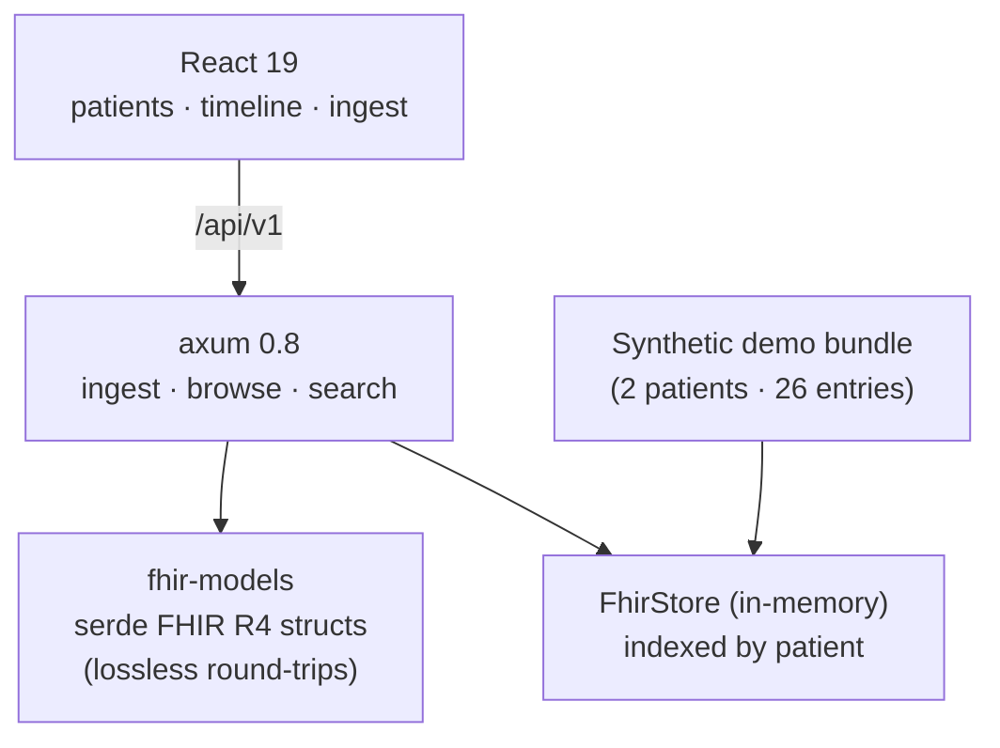

<p align="center">
  <h1>🩺 FHIR R4 Data Explorer</h1>
  <p><b>Ingest FHIR R4 resources, browse and search them, render longitudinal patient timelines</b></p>
  <p>
    <a href="https://github.com/akarales/fhir-r4-explorer/actions/workflows/ci.yml"></a>
    
    
    
    
  </p>
</p>

Healthcare data-standards fluency in one repo: hand-defined **serde FHIR R4
models** (strict where it matters, lossless everywhere), Bundle ingestion,
LOINC-filtered search, and the longitudinal patient timeline — the view
every clinical app actually needs. Rust (axum) core with a React client,
seeded with a synthetic demo bundle.

**Jump to:** [Features](#-features) · [Architecture](#-architecture) · [Quickstart](#-quickstart) · [Configuration](#️-configuration) · [API](#-api) · [Docs](#-documentation) · [Roadmap](#️-roadmap)

> [!WARNING]
> Demo application with synthetic data. Not for clinical use.

## ⚡ Features

- **Lossless serde models** — the four resources this ecosystem uses
  (Patient, Observation, Condition, MedicationStatement) with
  `#[serde(flatten)]` passthrough so unknown fields survive round-trips
  untouched
- **Correct code systems** — LOINC for observations, SNOMED CT for
  conditions, RxNorm for medications, with extraction helpers
- **Bundle transport** — tagged-enum entries; one POST ingests a mixed
  collection and returns typed counts
- **Longitudinal timeline** — every modeled event for a patient merged
  and sorted chronologically; one endpoint the client just renders
- **LOINC search** — filtered observation queries per patient

## 📐 Architecture



## 🚀 Quickstart

```bash
cargo run -p fhir-api        # :8004, seeded with the demo bundle
cd frontend && pnpm install && pnpm dev   # → http://localhost:5173
```

## ⚙️ Configuration

| Variable | Default | Notes |
|----------|---------|-------|
| `APP_PORT` | `8004` | 8000–8003 taken on this machine |
| `APP_DEMO_BUNDLE` | `crates/api/tests/fixtures/demo_bundle.json` | synthetic seed |

## 📡 API

| Endpoint | Purpose |
|----------|---------|
| `GET /health` | liveness |
| `POST /api/v1/bundles` | ingest a FHIR R4 Bundle (typed counts back) |
| `GET /api/v1/patients` | patient listing |
| `GET /api/v1/patients/{id}` | one patient |
| `GET /api/v1/patients/{id}/observations?loinc=` | LOINC-filtered observations |
| `GET /api/v1/patients/{id}/timeline` | merged chronological timeline |

curl + JSON: [docs/API.md](docs/API.md).

## 📚 Documentation

| Page | What's inside |
|------|---------------|
| [docs/ARCHITECTURE.md](docs/ARCHITECTURE.md) | Serde model design (flatten passthrough, tagged enums), store indexing |
| [docs/API.md](docs/API.md) | Bundle ingest, timeline shape, LOINC filters, errors |
| [docs/DEVELOPMENT.md](docs/DEVELOPMENT.md) | Setup, testing, the serde-tag gotcha |

## 🗺️ Roadmap

<details>
<summary>Phased plan</summary>

- [x] Phase 0 — scaffold: models, ingestion, timelines, CI
- [ ] Phase 1 — Postgres store (sqlx, JSONB + indexed columns), shared
      reference persistence for apps #2/#6
- [ ] Phase 2 — full-text search across conditions/medications (tsvector)
- [ ] Phase 3 — timeline diff view between two time windows

</details>

## 🤝 Contributing

PRs welcome — see [CONTRIBUTING.md](CONTRIBUTING.md). Gates: `cargo
clippy --workspace --all-targets -- -D warnings`, `cargo test
--workspace -q`, `pnpm build`.

## 📄 License

MIT — see [LICENSE](LICENSE).
